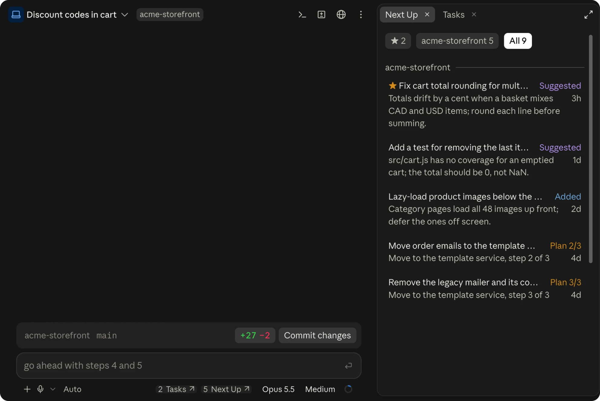
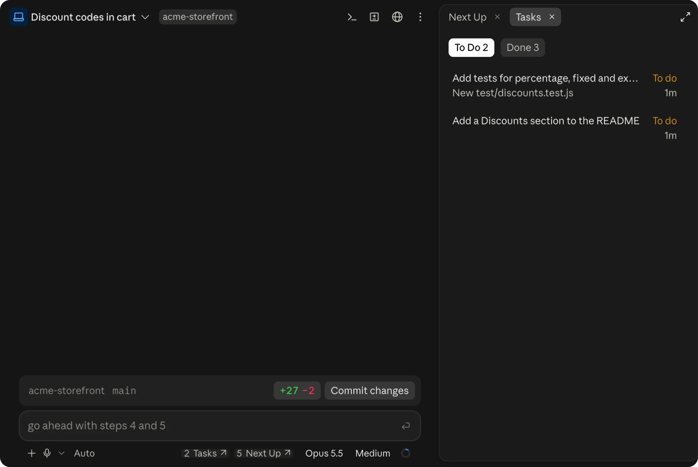
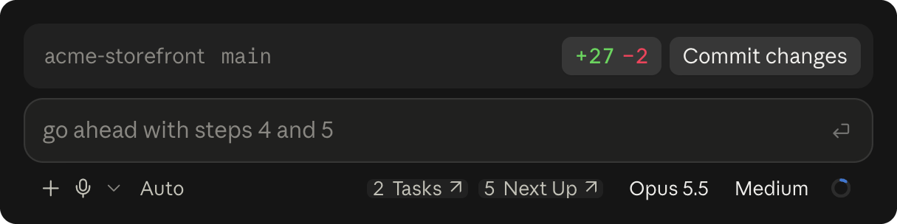

<div align="center">

# Next Up

**Keep the work Claude finds. See the work Claude is doing.**

A Claude Code mod with two parts. **Next Up** collects the follow-ups Claude suggests in
passing into one backlog shared by every session and project. **Tasks** has Claude keep a
checklist for multi-step work in the session you are in, which you can watch and edit.

[](LICENSE)
[](#install)
[](#known-limits)

| Next Up | Tasks |
|---|---|
|  |  |

</div>

---

## Why

Claude is good at noticing work outside the task in front of it: a bug spotted in passing, a
missing test, a docs gap, the refactor that should happen later. It offers these as suggestion
chips or as a closing paragraph, and then the session ends and they are gone. Next Up keeps
them, each with a prompt another session can act on without the conversation it came from.

Inside a session, the opposite problem: a long piece of work has steps, and it is hard to see
which are done, which are next, and whether Claude has quietly dropped one. Tasks puts them in
a list beside the conversation, kept by Claude as it works.

---

## Install

Claude Code **2.1.287 or later** (mods are on by default from that version).

```
/plugin marketplace add aosmcleod/next-up-mod
/plugin install next-up@next-up-mod
```

Or from a shell:

```bash
claude plugin marketplace add aosmcleod/next-up-mod
claude plugin install next-up@next-up-mod
```

Then start a new session, or run `/reload-plugins` in an open one. Two buttons appear in the
footer below the prompt, each with its count: **Tasks ↗** and **Next Up ↗**.



### Turning a part off

Both parts are on by default. Switch either off in `/config` (**Next Up backlog**,
**Session tasks**), with `/plugin configure next-up@next-up-mod`, or from a shell:

```bash
echo '{"tasks": "false"}' | claude plugin configure next-up@next-up-mod --values-stdin
```

Use `"backlog"` for Next Up, and `"true"` to switch a part back on. Restart Claude Code to
apply a change. With a part off, its button, pane, tools and guidance are all gone; with both
off, the mod does nothing.

---

## Next Up: the backlog

### Tasks come in by themselves

| Source | Label | How |
|---|---|---|
| Claude's suggestion chips | **Suggested** (purple) | Whenever Claude offers a background task, it goes to the backlog instead; no chip shows in the chat |
| Claude, on its own or when you ask | **Added** (blue) | Claude is told about the backlog and given an `add_tasks` tool |
| `/next plan <goal>` | **Plan 2/5** (amber) | Claude breaks the goal into ordered steps and files each one, without starting the work |

A task that repeats an open one in the same project, word for word or nearly, is merged into
it rather than listed twice.

### Starting one

Hover a card for its buttons:

- **↙ Now** puts the task's prompt in this session's prompt box, unsent, so you can edit it.
- **New ↗** opens a new desktop session in the task's project with the prompt ready in its box
  (desktop app only; it takes a few seconds to appear).
- **★** marks a favourite, which sorts first everywhere. The trash can drops the task.

When you send a prompt that still carries an open task's opening, in a session in that task's
project, the task is marked done.

### Where to see them

- **The footer button** shows how many tasks are open for the session's project, and opens or
  closes the pane.
- **The pane** has three tabs: **★** favourites, **this project**, and **All** (grouped by
  project).
- **The band** (`/next band`) lists the project's top three above the prompt until you send
  your next message.

---

## Tasks: the session list

For work that takes two or more steps, Claude plans the steps before it starts, marks each one
done as it finishes, and adds, rewords or removes steps as the work changes. Before it ends a
turn it checks the list: if steps remain and nothing blocks them, it carries on; otherwise it
says which remain and why. Questions and one-step changes get no list.

- **The footer button** shows how many steps are left, and opens or closes the Tasks pane.
- **The pane** has two tabs, **To Do** in Claude's planned order and **Done** with the newest
  first. To Do cards are labelled **To do** with when they were planned; done ones are struck
  through and labelled **Done** with when they were finished.
- **Your edits:** hover a To Do card to mark it **✓ Done** or remove it. Claude is told what
  you changed with your next message, and treats it as decided.

The list belongs to the session and lasts as long as it does; it is not saved to disk.

---

## Commands and tools

| Command | Does |
|---|---|
| `/next` | Opens or closes the Next Up pane (the Tasks pane, with Next Up off) |
| `/next tasks` | Opens or closes the Tasks pane |
| `/next list` · `/next all` | Lists open backlog tasks for this project, or for every project |
| `/next band` | Shows the project's top three backlog tasks above the prompt |
| `/next plan <goal>` | Asks Claude to plan the goal into the backlog as ordered steps |

Claude's tools: `add_tasks`, `list_tasks` and `update_task` for the backlog (so you can just
ask: *"add that to Next Up"*, *"what's in Next Up for this repo?"*), and
`update_session_tasks` for Tasks (add, reword, mark done, remove).

---

## What it touches

- **Data:** the backlog lives in `~/.claude/next-up/log/<session>.jsonl`, one append-only log
  per session. Each session writes only its own file and reads them all, so open sessions
  never overwrite each other. Plain JSON lines, safe to read or delete. Tasks are kept in
  memory only.
- **What it reads:** the suggestion chips Claude offers, calls to its own tools, and the
  prompts you send (only to match them against open tasks, on your machine).
- **What it tells Claude:** a short guide to the backlog and the session list. In the terminal
  it is part of the system prompt; in the desktop app, where a mod starts after the system
  prompt is built, it goes along with your first message instead. While session steps remain,
  the open ones go along with each message you send, and so do your edits from the Tasks pane.
  None of this appears in the conversation.
- **What it changes:** with Tasks on, Claude Code's own to-do reminders are left out, so
  Claude keeps a single list. The `add_tasks` and `update_session_tasks` tools are listed for
  Claude up front rather than behind tool search.
- **What it runs:** `git rev-parse` to find the session's project, `uname` once per session
  outside Windows, and `open` (macOS) or `rundll32` (Windows) for **New**.
- **Network:** none. Nothing leaves your machine.

---

## Known limits

- **New needs the Claude desktop app**, which runs on macOS and Windows. On Linux, use
  **Now**. On Windows a new session can take 5 to 10 seconds to appear, because the link is
  handed to a second app instance.
- **Suggestion chips are a desktop feature.** In the terminal, backlog tasks come in through
  Claude's `add_tasks` tool and `/next plan`.
- **The band is off until you ask for it.** On desktop, no mod runs until a session's first
  message, so a list shown at session start would vanish as soon as it appeared.
- **Colours are tuned for dark themes.** The card hover and tray use fixed dark colours.
- **Footer buttons look like the app's, not like Next Up's.** The desktop app draws every mod
  button in the footer in its own one-line style.
- **Backlog logs are never compacted.** A log only grows while its session adds or changes
  tasks, and only logs that changed are read again, so this stays small in practice.

---

## Development

```bash
git clone https://github.com/aosmcleod/next-up-mod
claude plugin marketplace add ./next-up-mod
claude plugin install next-up@next-up-mod
```

Installing copies the plugin into `~/.claude/plugins/cache/next-up-mod/next-up/<version>/`,
and sessions load that copy, even though `claude plugin list` reports the checkout as where it
is read from. After an edit, reinstall (`claude plugin uninstall next-up@next-up-mod`, then
`install` again) and start a new session or run `/reload-plugins`.

Checks, from the repo root:

```bash
claude plugin validate . --strict
claude plugin test .
```

`tsc -p . --noEmit` also works once Claude Code has loaded the plugin, which writes the
engine's type declarations to `.claude-plugin/types/` (gitignored).

| Path | Holds |
|---|---|
| `hooks/register.tsx` | The hooks: capture, the footer, panes and band, tools, guidance and `/next` |
| `hooks/store.ts` | The backlog's logic: folding logs, duplicates, labels, ages, sent prompts |
| `hooks/store-io.ts` | Reading and appending the per-session logs |
| `hooks/capture.ts` | Turning chips and `add_tasks` input into backlog tasks |
| `hooks/view.ts` | What the backlog's footer button, pane and band show |
| `hooks/session.ts` | The session task list: changes, what Claude is told, the Tasks pane |
| `types/index.d.ts` | The task models and the state the drawings read |
| `tests/` | `claude plugin test` suites for the plain modules |

---

## Author

Built by **Alec McLeod** ([@aosmcleod](https://github.com/aosmcleod)), a product manager who
kept losing Claude's best ideas at the end of a session.

Issues and pull requests are welcome.

---

## Licence

[MIT](LICENSE).
